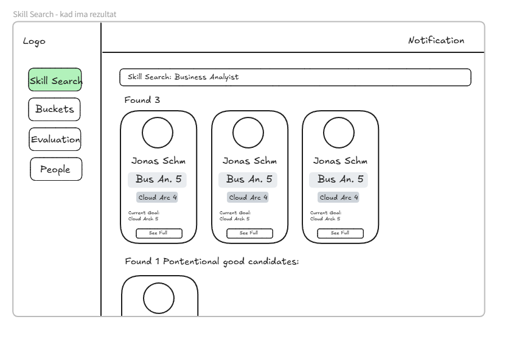
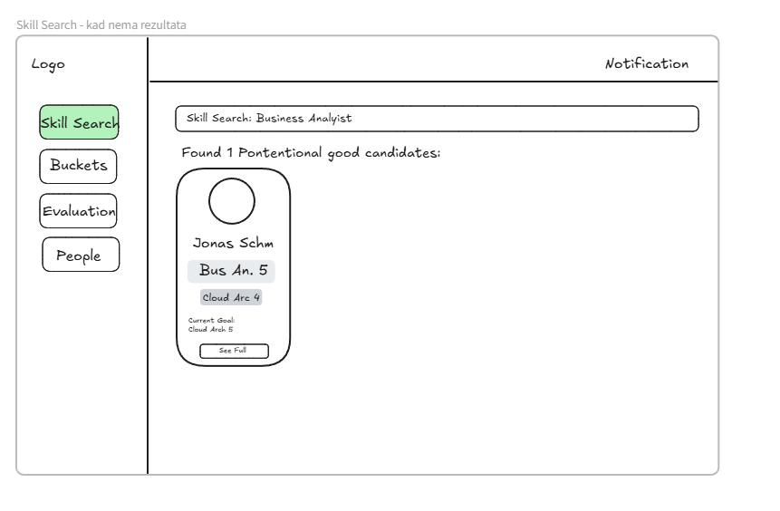
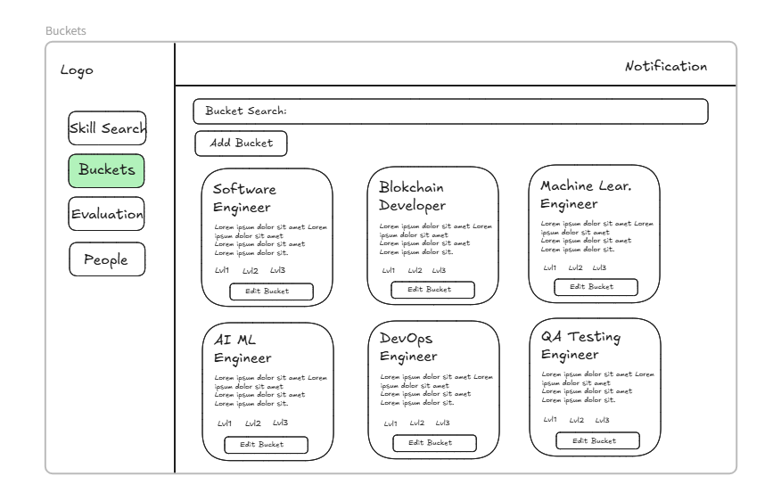
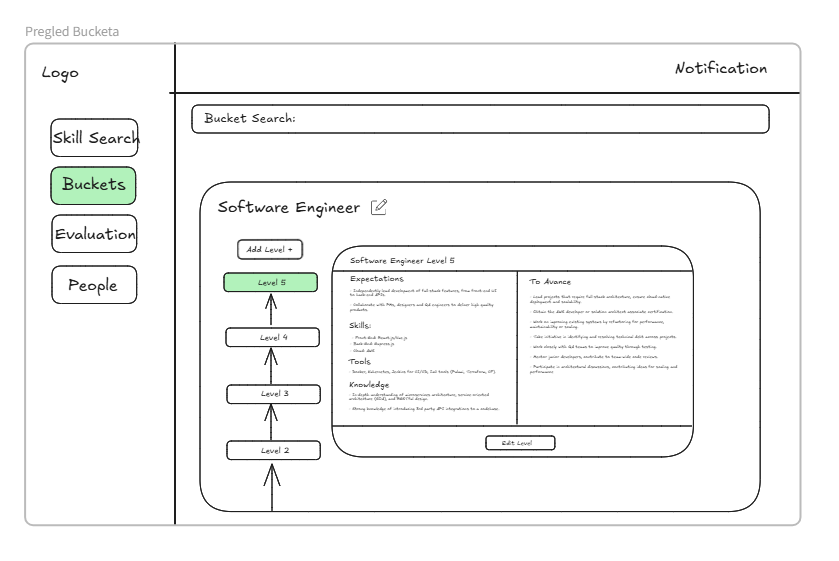
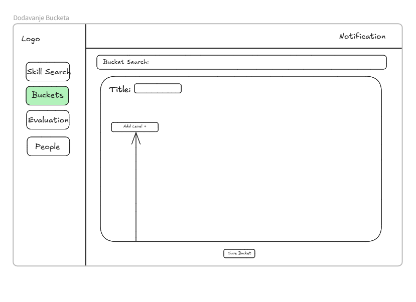
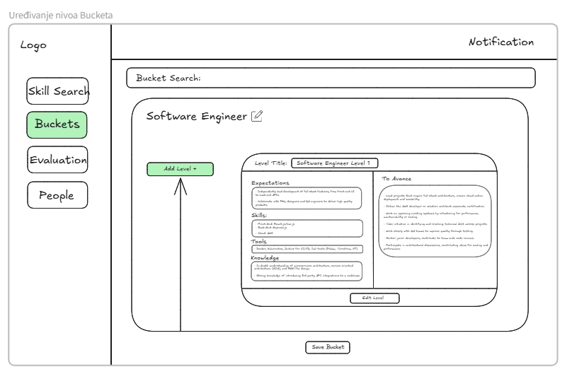
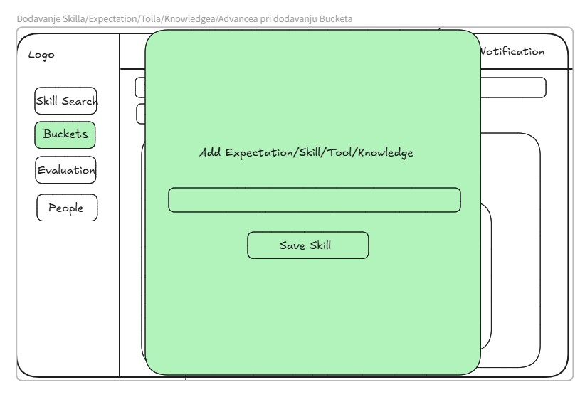
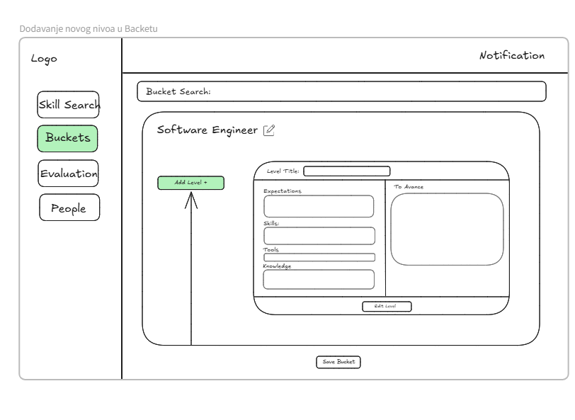
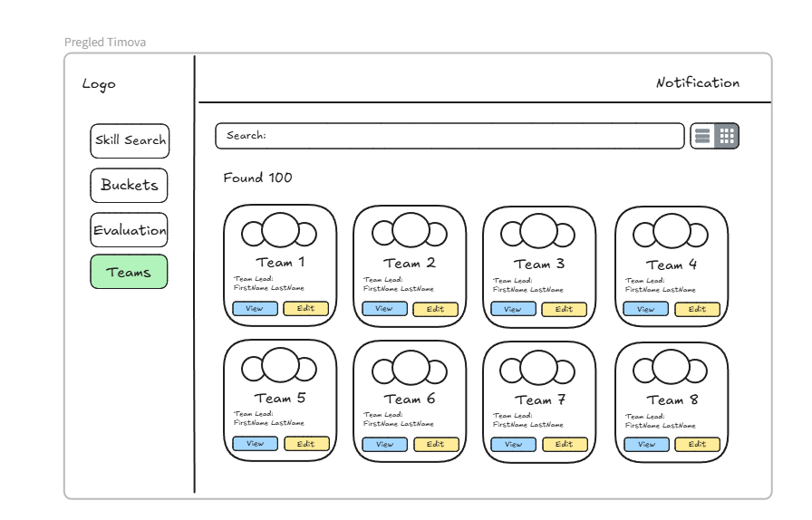

## 🔍 Skill Search

Prikaz vještina zaposlenika kroz jednostavan i pregledan UI.

### Opis

"Skill Search" omogućava brzo pretraživanje zaposlenika prema njihovim vještinama, trenutno postignutim nivoima i ciljevima. Korisnici mogu pregledati detalje o svakom zaposleniku i njihovom napretku kroz pregledne kartice.

### Ključne funkcionalnosti
- Pretraga zaposlenika po vještinama
- Prikaz trenutnih i ciljanih vještinskih nivoa
- Grid layout sa karticama
- Navigacija kroz lijevi meni (Skill Search, Buckets, Evaluation, People)
- Detaljan prikaz svakog zaposlenika (“See Full” dugme)

### Ko koristi
- HR timovi
- Menadžeri timova
- Zaposlenici koji žele uvid u vlastiti ili timski razvoj

### Interakcija
Korisnik unosi vještinu u polje za pretragu → sistem prikazuje sve zaposlenike koji odgovaraju kriteriju → klikom na “See Full” otvaraju se detalji o zaposleniku.

---

## 🔎 Skill Search – Rezultati

Prikaz rezultata nakon unosa konkretne vještine.

### Opis

Korisnik je unio konkretnu vještinu ("Business Analyst") i prikazani su svi relevantni kandidati, kao i potencijalni dobri kandidati koji se mogu razviti u traženom smjeru.

### Ključne funkcionalnosti
- Filtriranje kandidata prema unesenoj vještini
- Prikaz broja pronađenih kandidata
- Sekcija za "potential good candidates"
- Mogućnost otvaranja detalja za svakog kandidata

### Ko koristi
- HR menadžeri koji traže zaposlenike za određenu poziciju
- Mentori koji žele usmjeriti zaposlenike ka novim ciljevima

### Interakcija
Korisnik unosi naziv vještine → sistem filtrira i prikazuje relevantne profile → dodatno prikazuje potencijalne kandidate za razvoj → korisnik može otvoriti svaki profil.

---

## 🤔 Skill Search – Bez direktnih rezultata

Prikaz kada ne postoji direktno poklapanje, ali postoje potencijalni kandidati.

### Opis

Sistem nije pronašao nijednog zaposlenika koji tačno odgovara pretrazi, ali je predložio jednog potencijalnog kandidata koji bi se mogao razviti u tom smjeru.

### Ključne funkcionalnosti
- Identifikacija potencijalno dobrih kandidata
- Fallback prikaz kada nema direktnih rezultata
- Omogućavanje daljnje evaluacije kandidata

### Ko koristi
- HR specijalisti u potrazi za talentima koji se mogu razvijati
- Mentori koji prate napredak i razvoj vještina

### Interakcija
Korisnik unosi traženu vještinu → sistem ne pronalazi tačno poklapanje → prikazuje potencijalne kandidate koji mogu biti relevantni za dalji razvoj.

---

## 🪣 Buckets Overview

Pregled različitih tehničkih rola organizovanih u 'buckets'.

### Opis

“Buckets” predstavljaju grupisane tehničke pozicije sa specifičnim opisima i nivoima kompetencija (Lvl1, Lvl2, Lvl3). Svaki bucket je lako pretraživ i može se uređivati direktno iz ovog prikaza.

### Ključne funkcionalnosti
- Pretraga buckets prema nazivu
- Dodavanje novih buckets
- Prikaz opisa i nivoa vještina za svaki bucket
- Mogućnost uređivanja svakog bucketa

### Ko koristi
- HR timovi za definisanje uloga
- Tehnički lideri i mentori
- Menadžeri za planiranje karijernih putanja

### Interakcija
Korisnik može pretraživati postojeće buckets → kliknuti na “Edit Bucket” za uređivanje → dodavati nove buckets pomoću “Add Bucket” dugmeta.

---

## 🧱 Bucket Details – Software Engineer

Detaljan prikaz razina vještina i očekivanja za specifičan bucket.

### Opis

Unutar odabranog bucketa (npr. “Software Engineer”), prikazane su sve razine (Level 2–5) sa pripadajućim opisima očekivanja, potrebnih vještina, alata i znanja. Korisnik može dodavati nove razine ili uređivati postojeće.

### Ključne funkcionalnosti
- Prikaz hijerarhijskih razina za odabranu rolu
- Detaljni opisi: Expectations, Skills, Tools, Knowledge, To Advance
- Navigacija između nivoa
- Uređivanje i dodavanje novih razina

### Ko koristi
- Tehnički mentori za strukturisani razvoj zaposlenika
- HR timovi za mapiranje karijernih putanja
- Zaposlenici koji žele razumjeti zahtjeve viših pozicija

### Interakcija
Korisnik bira bucket → prikazuju se sve razine (npr. Level 2 do Level 5) → klikom na svaku razinu prikazuju se detalji → moguće je dodati novu ili uređivati postojeću razinu.

---

## ➕ Add New Bucket

Interfejs za kreiranje novog tehničkog bucketa.

### Opis

Korisnik može definisati novi bucket (npr. novu ulogu ili poziciju), dodati naslov i početne razine (levels). Interfejs je jednostavan i omogućava brzo strukturisanje novih buckets unutar sistema.

### Ključne funkcionalnosti
- Unos naziva novog bucketa
- Dodavanje levela pomoću “Add Level +” dugmeta
- Dugme za spremanje kompletnog bucketa
- Integracija sa sistemom za pretragu buckets

### Ko koristi
- HR timovi koji definišu nove uloge
- Organizacijski dizajneri
- Tehnički lideri koji žele formalizirati razvojne putanje

### Interakcija
Korisnik unosi naziv → dodaje željeni broj nivoa → klikom na “Save Bucket” sprema novu strukturu.

---

## ✏️ Edit Bucket Level

Uređivanje pojedinačnih nivoa unutar bucketa (npr. Software Engineer Level 1).

### Opis

Ovaj prikaz omogućava korisnicima da uređuju sve atribute jednog nivoa: naziv, očekivanja, potrebne vještine, alate, znanje i korake potrebne za napredovanje. Takođe je moguće dodati nove nivoe direktno iz ove forme.

### Ključne funkcionalnosti
- Uređivanje naslova nivoa i svih sekcija (Expectations, Skills, Tools, Knowledge, To Advance)
- Dodavanje novih nivoa pomoću “Add Level +”
- Spremanje promjena unutar kompletnog bucketa

### Ko koristi
- Mentori i tehnički lideri koji žele definisati jasne putanje razvoja
- HR specijalisti koji upravljaju karijernim okvirima

### Interakcija
Korisnik klikne na određeni nivo → uređuje njegov sadržaj → dodaje dodatne nivoe ako je potrebno → klikom na “Save Bucket” čuva sve promjene.

---

## 🧩 Add Skill/Expectation/Tool/Knowledge

Modalni prozor za unos nove stavke unutar nivoa bucketa.

### Opis

Ova komponenta omogućava korisniku da doda novi unos (npr. vještinu, očekivanje, alat ili znanje) kroz jednostavan i fokusiran modalni dijalog. Unos se automatski povezuje sa aktivnim nivoom unutar bucketa.

### Ključne funkcionalnosti
- Unos nove vrijednosti kroz formu
- Višenamjenska upotreba za različite sekcije (Skill, Tool, Expectation, itd.)
- Dugme za potvrdu unosa (“Save Skill”)

### Ko koristi
- Mentori i HR timovi koji kreiraju sadržaj unutar buckets
- Tehnički lideri koji žele dodati ključne kompetencije

### Interakcija
Korisnik klikne na “Add” unutar sekcije (npr. Skills) → otvara se modal → unosi naziv → klikne “Save Skill” → unos se dodaje u odgovarajuću sekciju.

---

## 🆕 Add New Level in Bucket

Forma za unos novog nivoa unutar specifičnog bucketa.

### Opis

Korisnici mogu dodati novi nivo za određenu rolu (npr. Software Engineer). Svaka sekcija – Expectations, Skills, Tools, Knowledge i To Advance – može se individualno popuniti kako bi se definisali zahtjevi i ciljevi tog nivoa.

### Ključne funkcionalnosti
- Unos naziva nivoa (Level Title)
- Pojedinačna polja za sve važne kategorije: Expectations, Skills, Tools, Knowledge, To Advance
- Dugme za dodavanje novog nivoa (“Add Level +”)
- Dugme za spremanje svih promjena u bucketu

### Ko koristi
- HR i organizacioni timovi
- Tehnički lideri koji žele proširiti razvojne putanje

### Interakcija
Korisnik klikne “Add Level +” → ispunjava potrebna polja → klikne “Save Bucket” za čuvanje nove strukture sa dodatim nivoom.

---

## 👥 Team Overview

Centralizovani prikaz svih timova u organizaciji.

### Opis

Korisnici mogu brzo pregledati sve postojeće timove, uključujući naziv tima i ime njihovog vođe. Svaki tim ima opcije za pregled detalja ("View") i uređivanje ("Edit").

### Ključne funkcionalnosti
- Prikaz kartica svih timova
- Pretraga timova po nazivu
- Prikaz vođe tima (Team Lead)
- Dugmad za “View” i “Edit” svakog tima
- Mogućnost prebacivanja prikaza (grid/list)

### Ko koristi
- Menadžeri timova
- Organizacijski administratori
- HR i analitički timovi

### Interakcija
Korisnik pretražuje tim po nazivu → prikazuju se relevantni timovi sa osnovnim podacima → klikom na “View” dobija se detaljan uvid, a klikom na “Edit” se uređuje sastav ili info o timu.

