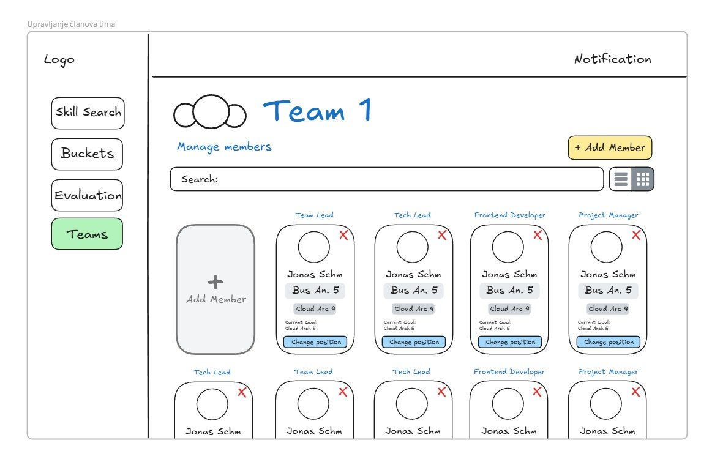

# 📄 System Documentation

**Last updated: 04. April 2025**

---

## 📚 Table of Contents
- [🧠 Skill Search](#-skill-search)
- [🧠 Skill Search – Results View](#-skill-search--results-view)
- [🧠 Skill Search – No Direct Results View](#-skill-search--no-direct-results-view)
- [🧱 Buckets View](#-buckets-view)
- [🧱 Bucket Detail View](#-bucket-detail-view)
- [➕ Add Bucket View](#-add-bucket-view)
- [✏️ Edit Bucket Level View](#-edit-bucket-level-view)
- [➕ Add Skill / Expectation / Tool / Knowledge Modal](#-add-skill--expectation--tool--knowledge-modal)
- [➕ Add New Level to Bucket](#-add-new-level-to-bucket)
- [👥 Team Overview View](#-team-overview-view)
- [📊 Admin Dashboard](#-admin-dashboard)
- [👥 Team Overview](#-team-overview)
- [✏️ Edit Team](#-edit-team)
- [❌ Delete Team](#-delete-team)
- [👥 Manage Team Members](#-manage-team-members)
- [🧠 Skill Search](#-skill-search)
- [🛡️ Evaluation](#-evaluation)
- [👥 People Overview](#-people-overview)
- [➕ Add New Member](#-add-new-member)
- [📋 Sažetak Izvještaja](#-pregled-sažetka-izvještaja)
- [➕ Add People and Bucket Selection](#add-people-and-bucket-selection)
- [➕ Add People](#add-people)
- [✏️ Edit People](#edit-people)
- [🧹 Bucket Level Selection](#bucket-level-selection)
- [👤 Pregled korisnika (Modal)](#pregled-korisnika-modal)
- [📄 Pregled korisničkih izvještaja](#pregled-korisnickih-izvjestaja)
- [➕ Add People and Bucket Selectio](#pregled-korisnickih-izvjestaja)

---

# 🧠 Skill Search

## Opis
Stranica omogućava superadminu i Hani-ju da pretražuju sve zaposlenike po vještinama. Rezultati pretrage prikazani su kao kartice sa osnovnim informacijama o zaposleniku.

## Ključne funkcionalnosti
- Skill Search input za pretragu vještina
- Brojač pronađenih korisnika ("Found 100")
- Lista zaposlenika prikazana kroz kartice
- Kartica prikazuje ime, glavnu i sekundarnu rolu, trenutni cilj i dugme za detaljan pregled ("See Full")
- Sidebar za navigaciju kroz glavne sekcije (Skill Search, Buckets, Evaluation, People)

## Ko koristi
Superadmin i CTO (Hani) za brzo pronalaženje zaposlenih na osnovu vještina i planiranje resursa.

## Interakcija
Unos ključne riječi u polje za pretragu filtrira prikazane zaposlenike. Klik na "See Full" otvara detaljan profil zaposlenika. Klik na navigaciju u sidebaru vodi na druge sekcije dashboarda.

---

---

# 🧠 Skill Search – Results View

## Opis
Stranica prikazuje rezultate pretrage nakon što admin ili CTO pretraže određenu vještinu. Prikazuje direktne poklapanja i AI-predložene potencijalno dobre kandidate.

## Ključne funkcionalnosti
- Search bar sa prikazom unesenog termina (npr. "Business Analyst")
- Prikaz broja direktnih pogodaka ("Found 3")
- Kartice zaposlenika sa imenom, trenutnom i sekundarnom rolom, trenutnim ciljem i dugmetom "See Full"
- Sekcija za prikaz potencijalno dobrih kandidata ("Found 1 Potential good candidates")

## Ko koristi
Superadmin i CTO (Hani) za traženje zaposlenih koji odgovaraju projektu ili otvorenoj poziciji.

## Interakcija
Unos termina u search bar i prikaz rezultata. Klik na "See Full" otvara detaljan profil korisnika. Pregled i poređenje direktnih i AI-predloženih kandidata.

---

---

# 🧠 Skill Search – No Direct Results View

## Opis
Stranica prikazuje situaciju kada nema direktnih poklapanja za unesenu vještinu, ali se prikazuje AI-predložen kandidat koji ima srodne kompetencije.

## Ključne funkcionalnosti
- Search bar sa prikazom pretraženog termina (npr. "Business Analyst")
- Obavijest "Found 1 Potential good candidates"
- Kartica AI-predloženog zaposlenika sa imenom, rolom, sekundarnom rolom i trenutnim ciljem
- Dugme "See Full" za otvaranje detaljnog profila

## Ko koristi
Superadmin i CTO (Hani) kada žele otkriti kandidate sa potencijalom za rolu, čak i ako ne postoji direktan match.

## Interakcija
Unos termina u search bar → prikaz potencijalnih kandidata. Klik na "See Full" za pregled detaljnog profila.

---

---

# 🧱 Buckets View

## Opis
Stranica omogućava superadminu i CTO-u da pregledaju, pretražuju i uređuju sve postojeće bucket-e (uloge) unutar firme.

## Ključne funkcionalnosti
- Search bar za pretragu bucket-a po imenu
- Dugme "Add Bucket" za kreiranje nove uloge
- Kartice za svaki bucket sa imenom, opisom, nivoima i dugmetom "Edit Bucket"
- Sidebar za navigaciju između sekcija

## Ko koristi
Superadmin i CTO (Hani) za strukturiranje karijernih puteva i upravljanje pozicijama unutar firme.

## Interakcija
Unos termina u "Bucket Search" filtrira bucket-e. Klik na "Add Bucket" otvara formu za kreiranje nove uloge. Klik na "Edit Bucket" vodi na uređivanje bucket-a.

---

---

# 🧱 Bucket Detail View

## Opis
Detaljni pregled pojedinačnog bucket-a (uloge), gdje su prikazani svi nivo-i i njihove specifične informacije.

## Ključne funkcionalnosti
- Pregled svih nivoa
- "Add Level +" dugme za kreiranje novog nivoa
- Detalji selektovanog nivoa (Expectations, Skills, Tools, Knowledge, To Advance)
- Dugme "Edit Level" za uređivanje informacija

## Ko koristi
CTO (Hani) i Superadmin za definisanje karijernih puteva.

## Interakcija
Klik na nivo u hijerarhiji prikazuje njegove detalje. Klik na "Edit Level" omogućava uređivanje.

---

---

# ➕ Add Bucket View

## Opis
Stranica za kreiranje novog bucket-a (uloge) u firmi.

## Ključne funkcionalnosti
- Unos naslova novog bucket-a
- Dugme "Add Level +" za dodavanje nivoa
- Dugme "Save Bucket" za potvrdu kreiranja

## Ko koristi
Superadmin i CTO (Hani) za kreiranje novih karijernih puteva.

## Interakcija
Unos naslova bucket-a i kreiranje nivoa. Klik na "Save Bucket" za potvrdu.

---

---

# ✏️ Edit Bucket Level View

## Opis
Stranica omogućava uređivanje postojećeg nivoa unutar bucket-a.

## Ključne funkcionalnosti
- Editable polje za naziv nivoa
- Sekcije za Expectations, Skills, Tools, Knowledge, To Advance
- "Edit Level" dugme za spremanje izmjena
- "Save Bucket" dugme za globalno spremanje

## Ko koristi
CTO (Hani) i Superadmin za održavanje karijernih puteva.

## Interakcija
Direktno uređivanje i spremanje sekcija.

---

---

# ➕ Add Skill / Expectation / Tool / Knowledge Modal

## Opis
Popup modal za dodavanje novih skillova, očekivanja, alata ili znanja u nivo.

## Ključne funkcionalnosti
- Polje za unos naziva
- Dugme "Save Skill" za potvrdu unosa

## Ko koristi
Superadmin i CTO (Hani) dok uređuju nivoe.

## Interakcija
Unos i spremanje novog elementa u odgovarajući odjeljak.

---

---

# ➕ Add New Level to Bucket

## Opis
Prikazuje inicijalno stanje novog nivoa nakon dodavanja u bucket.

## Ključne funkcionalnosti
- Unos naziva novog nivoa
- Prazna polja za sekcije
- Spremanje izmjena

## Ko koristi
Superadmin i CTO (Hani) za proširivanje karijernih puteva.

## Interakcija
Unos informacija i spremanje novog nivoa.

---

---

# 👥 Team Overview View

## Opis
Stranica prikazuje pregled svih formiranih timova u firmi.

## Ključne funkcionalnosti
- Search bar za pretragu timova
- Grid kartice za svaki tim (naziv, team lead)
- Dugmad "View" i "Edit"

## Ko koristi
Superadmin i CTO (Hani) za organizaciju timova.

## Interakcija
Pretraga timova, pregled članova, uređivanje tima.

---

---

# 📊 Admin Dashboard

## Opis
Stranica prikazuje pregled statusa promocija, performansi timova i analitike vještina unutar firme.

## Ključne funkcionalnosti
- Pregled pending promocija
- Prikaz promocija po kvartalima
- Tabela najboljih timova (Leaderboard)
- Analiza vještina koje zahtijevaju najviše vremena za razvoj

## Ko koristi
Superadmin i CTO (Hani) za strateško praćenje razvoja i planiranje intervencija.

## Interakcija
Pregled sažetih podataka, klik na promocije za više detalja, navigacija ka detaljima timova i zaposlenih.

---

---

# 👥 Team Overview

## Opis
Stranica prikazuje detaljan pregled odabranog tima, uključujući članove, informacije o timu i povezane projekte.

## Ključne funkcionalnosti
- Lista članova tima
- Informacije o nazivu, opisu i tehnologijama tima
- Veza sa aktivnim projektima
- Opcije za uređivanje i brisanje tima

## Ko koristi
Team Lead i Superadmin za organizaciju i analizu timova.

## Interakcija
Klik na članove za upravljanje, edit dugme za izmjenu podataka tima, delete dugme za brisanje tima.

---

---

# ✏️ Edit Team

## Opis
Stranica za uređivanje podataka odabranog tima, uključujući naziv, tehnologije i projekat na kojem tim radi.

## Ključne funkcionalnosti
- Editabilna polja za naziv i opis tima
- Dodavanje/brisanje tehnologija
- Povezivanje sa projektom
- Spremanje izmjena

## Ko koristi
Team Lead i Superadmin za održavanje ažurnih informacija o timovima.

## Interakcija
Unos novih vrijednosti u polja, dodavanje tehnologija kroz dropdown, spremanje promjena klikom na dugme "Save".

---

---

# ❌ Delete Team

## Opis
Modal za potvrdu brisanja tima sa svim njegovim članovima i povezanim podacima.

## Ključne funkcionalnosti
- Prikaz upozorenja o trajnom brisanju
- Dugme za potvrdu brisanja
- Dugme za otkazivanje akcije

## Ko koristi
Team Lead i Superadmin u slučaju gašenja ili reorganizacije tima.

## Interakcija
Klik na "Delete" dugme trajno briše tim; klik na "Cancel" zatvara modal bez akcije.

---

---

# 👥 Manage Team Members

## Opis
Stranica za upravljanje članovima tima — dodavanje novih, uklanjanje postojećih i ažuriranje njihovih uloga.

## Ključne funkcionalnosti
- Prikaz svih trenutnih članova tima
- Dodavanje novih članova
- Brisanje članova iz tima
- Uređivanje uloga članova

## Ko koristi
Team Lead i Superadmin za održavanje pravilne strukture tima.

## Interakcija
Klik na dugme "Add Member" za dodavanje, dugme za brisanje člana pored imena, inline edit za uloge.

---

---

# 🧠 Skill Search
## Opis
Stranica omogućava superadminu i CTO-u brzo pretraživanje svih zaposlenika po vještinama.

## Ključne funkcionalnosti
- Pretraga zaposlenika po vještinama
- Prikaz kartica zaposlenika sa opcijama za uređivanje i promociju
- Navigacija kroz sekcije dashboarda

## Ko koristi
Superadmin i CTO.

## Interakcija
Unos ključne riječi filtrira zaposlenike, klik na "Edit" ili "Promote" otvara dodatne opcije.

---

# 🛡️ Evaluation
## Opis
Stranica za pregled zaposlenika spremnih za promociju i upravljanje izvještajima.

## Ključne funkcionalnosti
- Lista zaposlenika spremnih za promociju
- Pisanje komentara i izvještaja
- Pregled svih izvještaja

## Ko koristi
Superadmin i CTO.

## Interakcija
Klik na "See Reports" otvara detaljan pregled korisničkih izvještaja.

---

# 👥 People Overview
## Opis
Stranica za administraciju zaposlenika, omogućava pretragu, uređivanje i dodavanje zaposlenih.

## Ključne funkcionalnosti
- Prikaz svih zaposlenika
- Brza pretraga i uređivanje profila
- Dodavanje novih zaposlenika

## Ko koristi
Superadmin.

## Interakcija
Klikom na "Edit" otvara se detaljan prikaz i uređivanje zaposlenika.

---

# ➕ Add New Member
## Opis
Ekran za dodavanje novih članova u tim, sa odabirom pozicije.

## Ključne funkcionalnosti
- Pretraga kandidata po ključnim riječima
- Odabir pozicije prije dodavanja
- Pregled članova prije potvrde

## Ko koristi
Superadmin i CTO.

## Interakcija
Dodavanje kandidata klikom na "Add to Team", potvrda klikom na "Done".

---

# 📋 Pregled sažetka izvještaja
## Opis
Stranica prikazuje skraćeni sažetak izvještaja zaposlenika.

## Ključne funkcionalnosti
- Vizualni pregled ciljeva
- Sažetak izvještaja

## Ko koristi
Superadmin i CTO.

## Interakcija
Klik na "See Summary" otvara pregled izvještaja.

---

# ➕ Add People and Bucket Selection

## Opis
Stranica omogućava superadminu i CTO-u da dodaju nove zaposlenike i dodijele im bucket-e (tj. glavne oblasti znanja ili kompetencija).

## Ključne funkcionalnosti
- Polja za unos imena, emaila, mobitela i opisa korisnika
- Dodavanje zaposlenika klikom na dugme "Add People"
- Mogućnost dodavanja bucket-a za odabranog korisnika

## Ko koristi
Superadmin i CTO (Hani) za dodavanje novih članova tima i inicijalnu kategorizaciju po vještinama.

## Interakcija
Unos informacija o korisniku i klik na "Add Person" dugme. Bucket-i se mogu dodavati klikom na dugme "Bucket +".

---

---

# ➕ Add People

## Opis
Minimalistička stranica za brzi unos osnovnih podataka o novom zaposleniku bez direktnog vezivanja na postojeće bucket-e.

## Ključne funkcionalnosti
- Polja za unos imena, emaila i mobitela
- Polje za unos opisa
- Dugme "Add Person" za spremanje unosa

## Ko koristi
Superadmin i CTO (Hani) za brzo dodavanje zaposlenih.

## Interakcija
Popunjavanje forme i klik na "Add Person". Nakon dodavanja, osoba se može dalje urediti ili dodavati bucket-i.

---

---

# ✏️ Edit People

## Opis
Stranica za uređivanje već postojećih zaposlenika, sa opcijama izmjene podataka i dodavanja novih bucket-a.

## Ključne funkcionalnosti
- Uređivanje imena, emaila, broja mobitela i opisa
- Upravljanje listom bucket-a

## Ko koristi
Superadmin i CTO (Hani) za ažuriranje profila zaposlenih.

## Interakcija
Izmjena podataka direktno u formi i spremanje izmjena klikom na "Edit Person" dugme.

---

---

# 🧹 Bucket Level Selection

## Opis
Detaljna stranica gdje superadmin i CTO mogu odabrati nivo vještine za svakog bucket-a koji osoba ima.

## Ključne funkcionalnosti
- Prikaz bucket-a sa opcijama za izbor nivoa (npr. Lvl 1, Lvl 2)
- Vizualni prikaz izabranih nivoa

## Ko koristi
Superadmin i CTO (Hani) za fino podešavanje nivoa vještina zaposlenika.

## Interakcija
Klik na bucket prikazuje nivoe koje korisnik može dostići. Odabir nivoa automatski se povezuje sa korisnikom.

---

---

# 👤 Pregled korisnika (Modal)

## Opis
Modal koji se otvara klikom na "See Reports" dugme. Prikazuje osnovne informacije o zaposleniku, trenutni nivo vještina i ocjene.

## Ključne funkcionalnosti
- Prikaz imena, vještina i nivoa
- Pregled izvještaja sa ocjenama (pozitivne i negativne)
- Dugme za otvaranje detaljnog pregleda svih izvještaja

## Ko koristi
Superadmin i CTO (Hani) za brzi pregled performansi zaposlenika.

## Interakcija
Klik na "See Reports" otvara modal. Unutar modala može se kliknuti na dugme za prikaz svih izvještaja.

---

---

# 📄 Pregled korisničkih izvještaja

## Opis
Stranica prikazuje detaljne izvještaje korisnika, sa istorijom i projektima povezanim sa napredovanjem u vještinama.

## Ključne funkcionalnosti
- Dropdown za odabir trenutno aktivnog bucket-a
- Lista izvještaja koji su potrebni za promociju
- Istorija prethodnih izvještaja
- Dugmad za pregled sažetka ili preuzimanje izvještaja kao PDF

## Ko koristi
Superadmin i CTO (Hani) za detaljnu procjenu napretka zaposlenika.

## Interakcija
Klik na "See Summary" za kratki pregled izvještaja ili na "Download PDF" za preuzimanje punog izvještaja.

---

---

# ➕ Add People and Bucket Selection

## Opis

Stranica omogućava superadminu i Hani-ju da pregledaju detalje o zaposleniku i dodaju ga u jedan ili više "bucket-a" na osnovu vještina i nivoa.

## Ključne funkcionalnosti

- Polje za pretragu zaposlenika ("Neki Search")
- Dugme "Add People" za dodavanje novih zaposlenika
- Prikaz profila zaposlenika: ime, email, broj telefona, opis
- Pregled dodijeljenih vještina i nivoa (npr. "Software Eng | Lvl 1")
- Dugme "Bucket +" za dodavanje novih bucket-a
- Dugme "Edit Person" za uređivanje podataka zaposlenika
- Sidebar za navigaciju kroz glavne sekcije (Skill Search, Buckets, Evaluation, People)

## Ko koristi

Superadmin i CTO (Hani) za brzo kreiranje novih profila i povezivanje sa vještinama.

## Interakcija

Popunjavanje forme, dodavanje bucket-a i nivoa klikom na dugme "Bucket +", te spremanje osobe klikom na "Edit Person".

---

---

