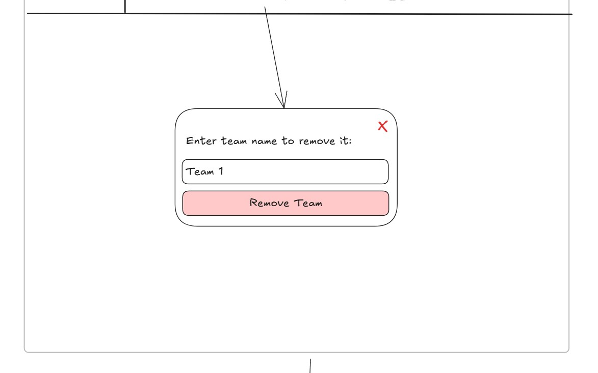
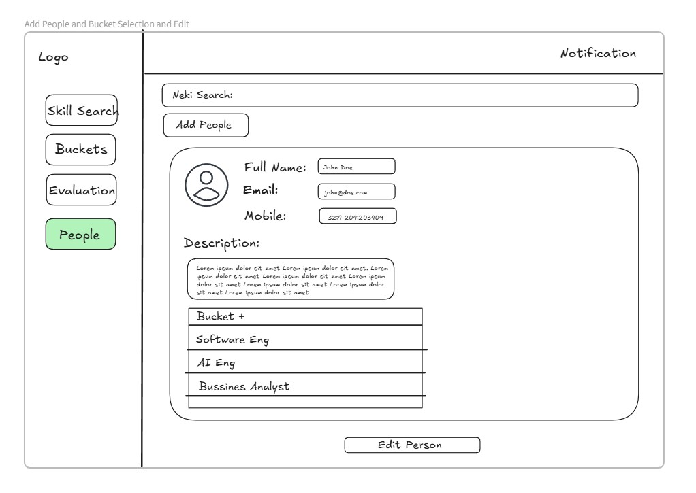
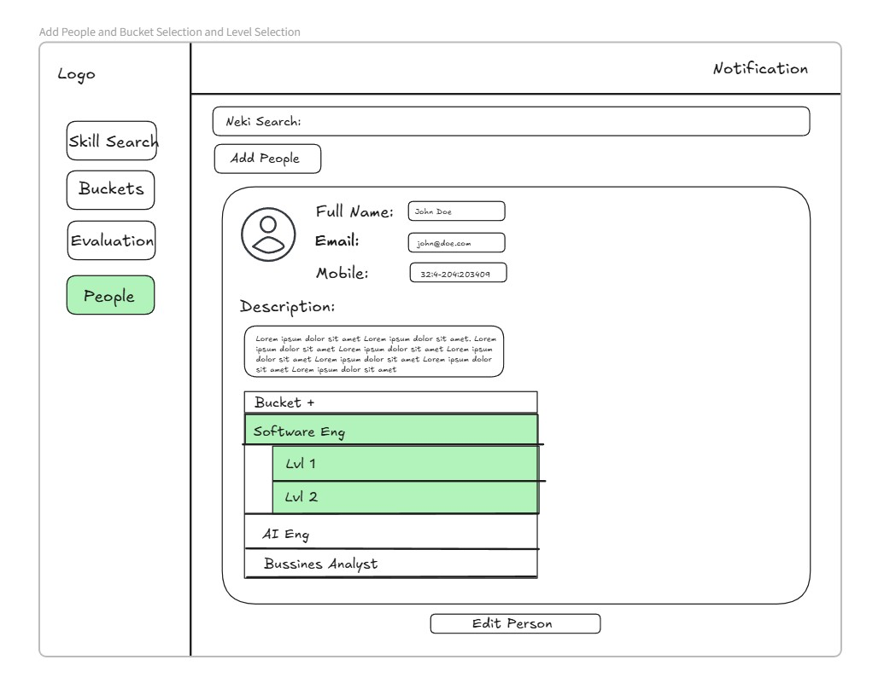

# 📄 System Documentation

**Last updated: 04. April 2025**

---

# 📚 Dokumentacija Sistema – Hani Projekat

## 1. Uvod

**Hani Platforma** je sistem za upravljanje karijernim napretkom i timovima, koji pomaže kompanijama da prate, razvijaju i promovišu svoje zaposlenike. Omogućava menadžmentu da definiše karijerne puteve (bucket-e), procjenjuje napredak zaposlenika, upravlja timovima i vodi strukturirane procese promocije.  
Kroz naprednu pretragu vještina, real-time dashboarde i strukturisane evaluacije, platforma pomaže kako administratorima tako i korisnicima da aktivno oblikuju svoj profesionalni razvoj.

Platforma je prvenstveno namijenjena za internu upotrebu od strane Superadmina, CTO-a, Team Leadova i zaposlenika, s ciljem da omogući transparentnost, strukturu i prilike za napredak unutar organizacije.

---

## 2. Funkcionalnosti

**Hani Platforma** nudi sljedeće funkcionalnosti:

- **Admin Dashboard** – Pregled promocija, performansi timova i razvoja vještina u firmi.
- **Pretraga vještina (Skill Search)** – Pretraga zaposlenika po vještinama i pronalazak idealnih kandidata.
- **Upravljanje bucket-ima** – Kreiranje, uređivanje i upravljanje karijernim putevima (bucket-i i nivoi).
- **Upravljanje timovima** – Kreiranje, uređivanje i praćenje timova, dodjeljivanje članova i analiza performansi.
- **Sistem evaluacije** – Pisanje izvještaja, praćenje napretka i vođenje procesa promocije zaposlenika.
- **Dashboard za korisnike** – Pregled zadataka, napretka i promocija za svakog zaposlenika.
- **Praćenje promocije** – Vizualizacija očekivanog vremena do naredne promocije.
- **Peer Review** – Sistem u kojem zaposleni ocjenjuju svoje kolege.
- **Upravljačka prava (Permissions)** – Različita prava pristupa za Superadmina, CTO-a, Team Leada i zaposlenike.
- **Generisanje izvještaja** – Pregled i preuzimanje izvještaja o napretku zaposlenika.

---

## 3. Stranice

Platforma uključuje sljedeće korisničke stranice:

- **Admin Dashboard** – Pregled statusa promocija, performansi timova i analiza vještina.
- **Pretraga vještina (Skill Search)** – Pretraga zaposlenika po vještinama uz direktne i AI-predložene kandidate.
- **Prikaz rezultata pretrage** – Prikaz kandidata koji direktno odgovaraju pretrazi.
- **Prikaz bez direktnih rezultata** – Prikaz potencijalnih kandidata kada nema direktnog poklapanja.
- **Pregled bucket-a** – Pregled svih karijernih puteva u kompaniji.
- **Detalji bucket-a** – Detaljan prikaz svih nivoa unutar jednog bucket-a.
- **Dodavanje bucket-a** – Kreiranje novog karijernog puta (bucket-a).
- **Uređivanje nivoa bucket-a** – Uređivanje postojećih nivoa, vještina i očekivanja.
- **Dodavanje vještine / očekivanja / alata / znanja** – Modal za unos novih elemenata.
- **Dodavanje novog nivoa u bucket** – Kreiranje novog nivoa u okviru bucket-a.
- **Pregled timova** – Pregled svih timova u firmi.
- **Detalji tima** – Pregled članova i projekata unutar odabranog tima.
- **Uređivanje tima** – Uređivanje podataka o timu.
- **Brisanje tima** – Potvrda i brisanje postojećeg tima.
- **Upravljanje članovima tima** – Dodavanje, uklanjanje i uređivanje članova tima.
- **Dodavanje novog člana** – Pretraga i dodavanje novih članova timu.
- **Pregled zaposlenika** – Upravljanje profilima svih zaposlenika.
- **Dodavanje zaposlenika i povezivanje sa bucket-ima** – Dodavanje novih zaposlenika i povezivanje sa karijernim putevima.
- **Dodavanje zaposlenika** – Brzi unos osnovnih podataka o zaposleniku.
- **Uređivanje zaposlenika** – Uređivanje postojećih podataka i bucket-a.
- **Odabir nivoa bucket-a** – Odabir nivoa vještina za zaposlenike.
- **Evaluacija** – Upravljanje procesima evaluacije i promocije zaposlenika.
- **Pregled korisnika (Modal)** – Kratki pregled napretka zaposlenika kroz izvještaje.
- **Pregled korisničkih izvještaja** – Detaljan pregled svih izvještaja zaposlenika.
- **Pregled sažetka izvještaja** – Skraćeni pregled izvještaja zaposlenika.
- **Dashboard Team Leada** – Dashboard za vođenje i evaluaciju tima.
- **Pregled korisničkih prava** – Pregled mogućnosti različitih korisničkih uloga.
- **Dashboard korisnika** – Pregled zadataka, napretka i peer review aktivnosti zaposlenika.
- **Pretraga i odabir bucket-a** – Pretraga dostupnih karijernih puteva.
- **Detalji trenutnog nivoa bucket-a** – Detalji trenutnog nivoa razvoja zaposlenika.
- **Pregled narednog nivoa** – Pregled zahtjeva za sljedeći nivo razvoja.
- **Napredovanje ka sljedećem nivou** – Praćenje preostalih koraka za napredovanje.
- **Pregled finalnog nivoa** – Pregled dostignuća na najvišem nivou karijere.

---

# 4. Functionality 

## 📚 Functionality Table of Contents
- [Admin Dashboard](#admin-dashboard)
- [Skill Search](#skill-search)
- [Skill Search – Results View](#skill-search--results-view)
- [Skill Search – No Direct Results View](#skill-search--no-direct-results-view)
- [Buckets View](#buckets-view)
- [Bucket Detail View](#bucket-detail-view)
- [Add Bucket View](#add-bucket-view)
- [Edit Bucket Level View](#edit-bucket-level-view)
- [Add Skill / Expectation / Tool / Knowledge Modal](#add-skill--expectation--tool--knowledge-modal)
- [Add New Level to Bucket](#add-new-level-to-bucket)
- [Team Overview View](#team-overview-view)
- [Team Overview](#team-overview)
- [Edit Team](#edit-team)
- [Delete Team](#delete-team)
- [Manage Team Members](#manage-team-members)
- [Add New Member](#add-new-member)
- [People Overview](#people-overview)
- [Add People and Bucket Selection](#add-people-and-bucket-selection)
- [Add People](#add-people)
- [Edit People](#edit-people)
- [Bucket Level Selection](#bucket-level-selection)
- [Evaluation](#evaluation)
- [Pregled korisnika (Modal)](#pregled-korisnika-modal)
- [Pregled korisničkih izvještaja](#pregled-korisničkih-izvještaja)
- [Pregled sažetka izvještaja](#pregled-sažetka-izvještaja)
- [Team Lead](#team-lead)
- [Team Lead Dashboard](#team-lead-dashboard)
- [User Permissions Overview](#user-permissions-overview)
- [User View – User Dashboard](#user-view--user-dashboard)
- [User View – Bucket Search and Selection](#user-view--bucket-search-and-selection)
- [User View – Bucket Level Detail](#user-view--bucket-level-detail)
- [User View – Next Bucket Level Preview](#user-view--next-bucket-level-preview)
- [User View – Next Level in Progress](#user-view--next-level-in-progress)
- [User View – Final Bucket Level Overview](#user-view--final-bucket-level-overview)

--- 

# Admin Dashboard

## Opis
Stranica prikazuje pregled statusa promocija, performansi timova i analitike vještina unutar firme.

## Ključne funkcionalnosti
- Pregled pending promocija
- Prikaz promocija po kvartalima
- Tabela najboljih timova (Leaderboard)
- Analiza vještina koje zahtijevaju najviše vremena za razvoj

## Ko koristi
Superadmin i CTO (Hani) za strateško praćenje razvoja i planiranje intervencija.

## Interakcija
Pregled sažetih podataka, klik na promocije za više detalja, navigacija ka detaljima timova i zaposlenih.

---

---

# Skill Search

## Opis
Stranica omogućava superadminu i Hani-ju da pretražuju sve zaposlenike po vještinama. Rezultati pretrage prikazani su kao kartice sa osnovnim informacijama o zaposleniku.

## Ključne funkcionalnosti
- Skill Search input za pretragu vještina
- Brojač pronađenih korisnika ("Found 100")
- Lista zaposlenika prikazana kroz kartice
- Kartica prikazuje ime, glavnu i sekundarnu rolu, trenutni cilj i dugme za detaljan pregled ("See Full")
- Sidebar za navigaciju kroz glavne sekcije (Skill Search, Buckets, Evaluation, People)

## Ko koristi
Superadmin i CTO (Hani) za brzo pronalaženje zaposlenih na osnovu vještina i planiranje resursa.

## Interakcija
Unos ključne riječi u polje za pretragu filtrira prikazane zaposlenike. Klik na "See Full" otvara detaljan profil zaposlenika. Klik na navigaciju u sidebaru vodi na druge sekcije dashboarda.

---

---

# Skill Search – Results View

## Opis
Stranica prikazuje rezultate pretrage nakon što admin ili CTO pretraže određenu vještinu. Prikazuje direktne poklapanja i AI-predložene potencijalno dobre kandidate.

## Ključne funkcionalnosti
- Search bar sa prikazom unesenog termina (npr. "Business Analyst")
- Prikaz broja direktnih pogodaka ("Found 3")
- Kartice zaposlenika sa imenom, trenutnom i sekundarnom rolom, trenutnim ciljem i dugmetom "See Full"
- Sekcija za prikaz potencijalno dobrih kandidata ("Found 1 Potential good candidates")

## Ko koristi
Superadmin i CTO (Hani) za traženje zaposlenih koji odgovaraju projektu ili otvorenoj poziciji.

## Interakcija
Unos termina u search bar i prikaz rezultata. Klik na "See Full" otvara detaljan profil korisnika. Pregled i poređenje direktnih i AI-predloženih kandidata.

---

---

# Skill Search – No Direct Results View

## Opis
Stranica prikazuje situaciju kada nema direktnih poklapanja za unesenu vještinu, ali se prikazuje AI-predložen kandidat koji ima srodne kompetencije.

## Ključne funkcionalnosti
- Search bar sa prikazom pretraženog termina (npr. "Business Analyst")
- Obavijest "Found 1 Potential good candidates"
- Kartica AI-predloženog zaposlenika sa imenom, rolom, sekundarnom rolom i trenutnim ciljem
- Dugme "See Full" za otvaranje detaljnog profila

## Ko koristi
Superadmin i CTO (Hani) kada žele otkriti kandidate sa potencijalom za rolu, čak i ako ne postoji direktan match.

## Interakcija
Unos termina u search bar → prikaz potencijalnih kandidata. Klik na "See Full" za pregled detaljnog profila.

---

---

# Buckets View

## Opis
Stranica omogućava superadminu i CTO-u da pregledaju, pretražuju i uređuju sve postojeće bucket-e (uloge) unutar firme.

## Ključne funkcionalnosti
- Search bar za pretragu bucket-a po imenu
- Dugme "Add Bucket" za kreiranje nove uloge
- Kartice za svaki bucket sa imenom, opisom, nivoima i dugmetom "Edit Bucket"
- Sidebar za navigaciju između sekcija

## Ko koristi
Superadmin i CTO (Hani) za strukturiranje karijernih puteva i upravljanje pozicijama unutar firme.

## Interakcija
Unos termina u "Bucket Search" filtrira bucket-e. Klik na "Add Bucket" otvara formu za kreiranje nove uloge. Klik na "Edit Bucket" vodi na uređivanje bucket-a.

---

---

# Bucket Detail View

## Opis
Detaljni pregled pojedinačnog bucket-a (uloge), gdje su prikazani svi nivo-i i njihove specifične informacije.

## Ključne funkcionalnosti
- Pregled svih nivoa
- "Add Level +" dugme za kreiranje novog nivoa
- Detalji selektovanog nivoa (Expectations, Skills, Tools, Knowledge, To Advance)
- Dugme "Edit Level" za uređivanje informacija

## Ko koristi
CTO (Hani) i Superadmin za definisanje karijernih puteva.

## Interakcija
Klik na nivo u hijerarhiji prikazuje njegove detalje. Klik na "Edit Level" omogućava uređivanje.

---

---

# Add Bucket View

## Opis
Stranica za kreiranje novog bucket-a (uloge) u firmi.

## Ključne funkcionalnosti
- Unos naslova novog bucket-a
- Dugme "Add Level +" za dodavanje nivoa
- Dugme "Save Bucket" za potvrdu kreiranja

## Ko koristi
Superadmin i CTO (Hani) za kreiranje novih karijernih puteva.

## Interakcija
Unos naslova bucket-a i kreiranje nivoa. Klik na "Save Bucket" za potvrdu.

---

---

# Edit Bucket Level View

## Opis
Stranica omogućava uređivanje postojećeg nivoa unutar bucket-a.

## Ključne funkcionalnosti
- Editable polje za naziv nivoa
- Sekcije za Expectations, Skills, Tools, Knowledge, To Advance
- "Edit Level" dugme za spremanje izmjena
- "Save Bucket" dugme za globalno spremanje

## Ko koristi
CTO (Hani) i Superadmin za održavanje karijernih puteva.

## Interakcija
Direktno uređivanje i spremanje sekcija.

---

---

# Add Skill / Expectation / Tool / Knowledge Modal

## Opis
Popup modal za dodavanje novih skillova, očekivanja, alata ili znanja u nivo.

## Ključne funkcionalnosti
- Polje za unos naziva
- Dugme "Save Skill" za potvrdu unosa

## Ko koristi
Superadmin i CTO (Hani) dok uređuju nivoe.

## Interakcija
Unos i spremanje novog elementa u odgovarajući odjeljak.

---

---

# Add New Level to Bucket

## Opis
Prikazuje inicijalno stanje novog nivoa nakon dodavanja u bucket.

## Ključne funkcionalnosti
- Unos naziva novog nivoa
- Prazna polja za sekcije
- Spremanje izmjena

## Ko koristi
Superadmin i CTO (Hani) za proširivanje karijernih puteva.

## Interakcija
Unos informacija i spremanje novog nivoa.

---

---

# Team Overview View

## Opis
Stranica prikazuje pregled svih formiranih timova u firmi.

## Ključne funkcionalnosti
- Search bar za pretragu timova
- Grid kartice za svaki tim (naziv, team lead)
- Dugmad "View" i "Edit"

## Ko koristi
Superadmin i CTO (Hani) za organizaciju timova & Team Lead

## Interakcija
Pretraga timova, pregled članova, uređivanje tima.

---

---

# Team Overview

## Opis
Stranica prikazuje detaljan pregled odabranog tima, uključujući članove, informacije o timu i povezane projekte.

## Ključne funkcionalnosti
- Lista članova tima
- Informacije o nazivu, opisu i tehnologijama tima
- Veza sa aktivnim projektima
- Opcije za uređivanje i brisanje tima
- Team Lead i SuperAdmin mogu da ostave report na clana tima

## Ko koristi
Team Lead i Superadmin za organizaciju i analizu timova.

## Interakcija
Klik na članove za upravljanje, edit dugme za izmjenu podataka tima, delete dugme za brisanje tima.

---

---

# Edit Team

## Opis
Stranica za uređivanje podataka odabranog tima, uključujući naziv, tehnologije i projekat na kojem tim radi.

## Ključne funkcionalnosti
- Editabilna polja za naziv i opis tima
- Dodavanje/brisanje tehnologija
- Povezivanje sa projektom
- Spremanje izmjena
- Team Lead i SuperAdmin mogu da ostave report na clana tima

## Ko koristi
Team Lead i Superadmin za održavanje ažurnih informacija o timovima. 

## Interakcija
Unos novih vrijednosti u polja, dodavanje tehnologija kroz dropdown, spremanje promjena klikom na dugme "Save".

---

---

# Delete Team

## Opis
Modal za potvrdu brisanja tima sa svim njegovim članovima i povezanim podacima.

## Ključne funkcionalnosti
- Prikaz upozorenja o trajnom brisanju
- Dugme za potvrdu brisanja
- Dugme za otkazivanje akcije

## Ko koristi
Team Lead i Superadmin u slučaju gašenja ili reorganizacije tima.

## Interakcija
Klik na "Delete" dugme trajno briše tim; klik na "Cancel" zatvara modal bez akcije.

---

---

# Manage Team Members

## Opis
Stranica za upravljanje članovima tima — dodavanje novih, uklanjanje postojećih i ažuriranje njihovih uloga.

## Ključne funkcionalnosti
- Prikaz svih trenutnih članova tima
- Dodavanje novih članova
- Brisanje članova iz tima
- Uređivanje uloga članova
- Team Lead i SuperAdmin mogu da ostave report na clana tima
- 
## Ko koristi
Team Lead i Superadmin za održavanje pravilne strukture tima.

## Interakcija
Klik na dugme "Add Member" za dodavanje, dugme za brisanje člana pored imena, inline edit za uloge.

--- 

---

# Add New Member

## Opis
Ekran za dodavanje novih članova u tim, sa odabirom pozicije.

## Ključne funkcionalnosti
- Pretraga kandidata po ključnim riječima
- Odabir pozicije prije dodavanja
- Pregled članova prije potvrde

## Ko koristi
Superadmin i CTO.

## Interakcija
Dodavanje kandidata klikom na "Add to Team", potvrda klikom na "Done".

---

# People Overview

## Opis
Stranica za administraciju zaposlenika, omogućava pretragu, uređivanje i dodavanje zaposlenih.

## Ključne funkcionalnosti
- Prikaz svih zaposlenika
- Brza pretraga i uređivanje profila
- Dodavanje novih zaposlenika

## Ko koristi
Superadmin.

## Interakcija
Klikom na "Edit" otvara se detaljan prikaz i uređivanje zaposlenika.

---

# Add People and Bucket Selection

## Opis

Stranica omogućava superadminu i Hani-ju da pregledaju detalje o zaposleniku i dodaju ga u jedan ili više "bucket-a" na osnovu vještina i nivoa.

## Ključne funkcionalnosti

- Polje za pretragu zaposlenika ("Neki Search")
- Dugme "Add People" za dodavanje novih zaposlenika
- Prikaz profila zaposlenika: ime, email, broj telefona, opis
- Pregled dodijeljenih vještina i nivoa (npr. "Software Eng | Lvl 1")
- Dugme "Bucket +" za dodavanje novih bucket-a
- Dugme "Edit Person" za uređivanje podataka zaposlenika
- Sidebar za navigaciju kroz glavne sekcije (Skill Search, Buckets, Evaluation, People)

## Ko koristi

Superadmin i CTO (Hani) za brzo kreiranje novih profila i povezivanje sa vještinama.

## Interakcija

Popunjavanje forme, dodavanje bucket-a i nivoa klikom na dugme "Bucket +", te spremanje osobe klikom na "Edit Person".

---

---

# Add People

## Opis
Minimalistička stranica za brzi unos osnovnih podataka o novom zaposleniku bez direktnog vezivanja na postojeće bucket-e.

## Ključne funkcionalnosti
- Polja za unos imena, emaila i mobitela
- Polje za unos opisa
- Dugme "Add Person" za spremanje unosa

## Ko koristi
Superadmin i CTO (Hani) za brzo dodavanje zaposlenih.

## Interakcija
Popunjavanje forme i klik na "Add Person". Nakon dodavanja, osoba se može dalje urediti ili dodavati bucket-i.

---

---

# Edit People

## Opis
Stranica za uređivanje već postojećih zaposlenika, sa opcijama izmjene podataka i dodavanja novih bucket-a.

## Ključne funkcionalnosti
- Uređivanje imena, emaila, broja mobitela i opisa
- Upravljanje listom bucket-a

## Ko koristi
Superadmin i CTO (Hani) za ažuriranje profila zaposlenih.

## Interakcija
Izmjena podataka direktno u formi i spremanje izmjena klikom na "Edit Person" dugme.

---

---

# Bucket Level Selection

## Opis
Detaljna stranica gdje superadmin i CTO mogu odabrati nivo vještine za svakog bucket-a koji osoba ima.

## Ključne funkcionalnosti
- Prikaz bucket-a sa opcijama za izbor nivoa (npr. Lvl 1, Lvl 2)
- Vizualni prikaz izabranih nivoa

## Ko koristi
Superadmin i CTO (Hani) za fino podešavanje nivoa vještina zaposlenika.

## Interakcija
Klik na bucket prikazuje nivoe koje korisnik može dostići. Odabir nivoa automatski se povezuje sa korisnikom.

---

---

# Evaluation

## Opis
Stranica za pregled zaposlenika spremnih za promociju i upravljanje izvještajima.

## Ključne funkcionalnosti
- Lista zaposlenika spremnih za promociju
- Pisanje komentara i izvještaja
- Pregled svih izvještaja

## Ko koristi
Superadmin i CTO.

## Interakcija
Klik na "See Reports" otvara detaljan pregled korisničkih izvještaja.
Klik na "Leave Comm" otvara modal za unos komentara
Klik na "See report" otvara modal za SuperAdmin report
Klik na "Promote" promotea usera

---

# Pregled korisnika (Modal)

## Opis
Modal koji se otvara klikom na "See Reports" dugme. Prikazuje informacije o zaposleniku, trenutni nivo, da li je taj nivo spreman za promotion, listu kriterija koje je zadovoljio da predje na novi nivo (sentimentirana iz svig reportova), summary svih reportova.

## Ključne funkcionalnosti
- Prikaz imena, vještina i nivoa
- Pregled izvještaja sa ocjenama (pozitivne i negativne)
- Dugme za otvaranje detaljnog pregleda svih izvještaja

## Ko koristi
Superadmin i CTO (Hani) za brzi pregled performansi zaposlenika.

## Interakcija
Klik na "See Reports" otvara modal. Unutar modala može se kliknuti na dugme za prikaz svih izvještaja.

---

---

# Pregled korisničkih izvještaja

## Opis
Stranica prikazuje detaljne izvještaje korisnika, sa istorijom i projektima povezanim sa napredovanjem u vještinama.

## Ključne funkcionalnosti
- Dropdown za odabir trenutno aktivnog bucket-a
- Lista izvještaja koji su potrebni za promociju
- Istorija prethodnih izvještaja
- Dugmad za pregled sažetka ili preuzimanje izvještaja kao PDF

## Ko koristi
Superadmin i CTO (Hani) za detaljnu procjenu napretka zaposlenika.

## Interakcija
Klik na "See Summary" za kratki pregled izvještaja ili na "Download PDF" za preuzimanje punog izvještaja.

---

# Pregled sažetka izvještaja

## Opis
Stranica prikazuje skraćeni sažetak izvještaja zaposlenika.

## Ključne funkcionalnosti
- Vizualni pregled ciljeva
- Sažetak izvještaja

## Ko koristi
Superadmin i CTO.

## Interakcija
Klik na "See Summary" otvara pregled izvještaja.

---
---
---

# Team Lead 
Team Lead ima pristup i funkcijama koje koristi Superadmin, kao što su:

- **Team Overview View**
- **Team Overview**
- **Edit Team**
- **Delete Team**
- **Manage Team Members**
- **Add New Member**

# Team Lead Dashboard

## Opis
Dashboard za Team Lead-ove pruža brz pregled performansi njihovog tima i omogućava ostavljanje povratnih informacija za članove tima.

Time se omogućava vođenje i održavanje timova uz veću samostalnost.

## Ključne funkcionalnosti
- **Pending Reviews**: Prikaz broja izvještaja koji čekaju da Team Lead ocijeni.
- **Average Score**: Prikaz prosječne ocjene tima.
- **Promotions in Team by Quarter**: Grafikon koji prikazuje broj promocija unutar tima po kvartalima.
- **Submit Review**: Forma za ostavljanje povratne informacije za zaposlenike, uključujući ukupni feedback, snage i oblasti za poboljšanje.
- **Team Structure**: Prikaz strukture tima prema pozicijama i broju članova.
- **Skills Being Developed**: Lista vještina koje se razvijaju unutar tima.

## Ko koristi
Team Lead za:

- Upravljanje timskim performansama
- Ocjenjivanje i razvoj članova tima
- Praćenje razvoja vještina i promocija
- Organizaciju tima (dodavanje, uređivanje, brisanje članova)

## Interakcija
Team Lead može:

- Brzo vidjeti ključne metrike tima
- Ostaviti povratne informacije zaposlenicima kroz formu "Submit Review"
- Analizirati strukturu tima i razvijane vještine
- Koristiti opcije koje su inače dostupne Superadminu za pregled, uređivanje i upravljanje timovima i članovima

# User Permissions Overview

## Opis
Prikaz prava i mogućnosti različitih korisničkih uloga u sistemu.

| Funkcionalnost | Superadmin | CTO (Hani) | Team Lead |
|:---|:---:|:---:|:---:|
| **Pregled Dashboard-a** | ✅ | ✅ | ✅ (svoj tim) |
| **Pretraga zaposlenika po vještinama** | ✅ | ✅ | ❌ |
| **Upravljanje bucket-ima** | ✅ | ✅ | ❌ |
| **Kreiranje i uređivanje bucket-a** | ✅ | ✅ | ❌ |
| **Upravljanje timovima** | ✅ | ✅ | ✅ (svoj tim) |
| **Dodavanje novih članova** | ✅ | ✅ | ✅ (samo svom timu) |
| **Brisanje timova** | ✅ | ✅ | ✅ (samo svoj tim) |
| **Upravljanje članovima tima** | ✅ | ✅ | ✅ (svoj tim) |
| **Dodavanje novih zaposlenika** | ✅ | ✅ | ❌ |
| **Upravljanje evaluacijama** | ✅ | ✅ | ✅ (svoj tim) |
| **Pisanje izvještaja i komentara** | ✅ | ✅ | ✅ (svoj tim) |
| **Promovisanje zaposlenika** | ✅ | ✅ | ❌ |
| **Pregled izvještaja** | ✅ | ✅ | ✅ (svoj tim) |
| **Pristup svim korisničkim podacima** | ✅ | ✅ | ❌ |

---

## Objašnjenje
- **Superadmin** ima puni pristup svim funkcionalnostima sistema bez ograničenja.
- **CTO (Hani)** je SuperAdmin
- **Team Lead** ima pristup samo svom timu i alatima za vođenje tima (dashboard, upravljanje članovima, evaluacije), bez mogućnosti dodavanja novih bucket-a ili upravljanja cijelom organizacijom.

---
---
---
# User

# User View – User Dashboard

## Opis

Dashboard korisnika pruža pregled trenutnog napretka kroz različite bucket-e, zadataka, peer review aktivnosti i predviđanja vremena do promocije.

## Ključne funkcionalnosti

- **Task Progress**: Prikaz aktivnih bucket-a sa napretkom po zadacima (task checklist i progress bar).
- **Peer Review**: Sekcija za peer review, gdje korisnik može ocijeniti kolege. Statusi uključuju "Take" za preuzimanje review-a i "Done" za završene review-e.
- **Average Grade**: Prikaz trenutne prosječne ocjene koju korisnik ima.
- **Expected Time Until Promotion**: Prikaz očekivanog vremena (npr. 3 mjeseca) do sljedeće promocije.

## Ko koristi

Zaposlenici za praćenje vlastitog napretka, zadataka, ocjenjivanje kolega i pripremu za promociju.

## Interakcija

- Klik na **Take** u Peer Review sekciji omogućava započinjanje ocjenjivanja kolege.
- Klik na zadatke omogućava označavanje zadatka kao završenog.
- Vizualno praćenje napretka prema ciljevima i promociji kroz progress bar i metrike.

---

---

# User View – Bucket Search and Selection

## Opis

Stranica omogućava korisniku (zaposleniku) da pretražuje dostupne karijerne puteve ("bucket-e"), pregleda svoj trenutni napredak i odabere nove bucket-e koje želi pratiti.

## Ključne funkcionalnosti

- **Bucket Search**: Polje za pretragu bucket-a po nazivu.
- **Prikaz trenutnih bucket-a**: Kartice sa imenom bucket-a, trenutnim nivoom (Current Level) i ciljnim nivoima (Goals).
- **Preporučeni bucket-i**: Bucket-i koje korisnik još nije odabrao prikazani su u sivoj boji sa opcijom "Take Bucket" za preuzimanje.
- **Notifikacije**: Ikona za notifikacije u gornjem desnom uglu za obavještenja korisnika.

## Ko koristi

Zaposlenici koji žele pratiti svoj karijerni napredak i odabrati nove puteve razvoja.

## Interakcija

- Unos termina u polje **Bucket Search** filtrira dostupne bucket-e.
- Klik na **See Bucket** otvara detalje i omogućava korisniku uređivanje trenutnog napretka.
- Klik na **Take Bucket** omogućava korisniku da preuzme novi bucket i započne novi razvojni put.

---

---

# User View – Bucket Level Detail

## Opis

Stranica prikazuje detaljan pregled trenutnog nivoa korisnika unutar odabranog bucket-a, zajedno sa očekivanjima, potrebnim vještinama, alatima i znanjima.

## Ključne funkcionalnosti

- **Level Progression**: Vizualni prikaz svih nivoa u bucket-u sa označenim trenutnim nivoom (npr. SE3) i mogućnošću pregleda prethodnog i sljedećeg nivoa.
- **Current Level**: Prikaz imena trenutnog nivoa (npr. Software Engineer 3).
- **Your Level Expectations**: Lista očekivanja koja korisnik mora ispuniti na trenutnom nivou.
- **Skills**: Lista vještina potrebnih za nivo.
- **Tools**: Lista tehnologija i alata povezanih sa nivoom, prikazana kroz tagove.
- **Knowledge**: Polje za buduće dodatke znanja vezane za nivo

## Ko koristi

Zaposlenici za praćenje trenutnih zahtjeva, planiranje razvoja i pripremu za prelazak na sljedeći nivo.

## Interakcija

- Klik na **Previous**/ **Next Level** dugmad omogućava navigaciju između nivoa unutar bucket-a.
- Pregled očekivanja, vještina i alata koje je potrebno razviti da bi se napredovalo.

---

---

# User View – Next Bucket Level Preview

## Opis

Stranica prikazuje pregled sljedećeg nivoa koji korisnik može dostići unutar svog bucket-a. Sadrži očekivanja, potrebne vještine, alate i znanja za napredovanje.

## Ključne funkcionalnosti

- **Level Progression**: Vizualni prikaz svih nivoa u bucket-u sa označenim trenutnim i sljedećim nivoom (npr. SE4).
- **Next Level**: Prikaz imena sljedećeg nivoa (npr. Software Engineer 4).
- **Next Level Expectations**: Lista novih očekivanja koja korisnik mora ispuniti da bi napredovao na viši nivo.
- **Skills**: Lista vještina potrebnih za dostizanje sljedećeg nivoa.
- **Tools**: Lista alata i tehnologija vezanih za novi nivo.
- **Knowledge**: Polje za buduće dodatke znanja vezane za nivo (trenutno prazno).

## Ko koristi

Zaposlenici koji žele znati šta ih čeka u narednom nivou karijernog puta i kako se pripremiti za napredovanje.

## Interakcija

- Klik na **Next Level** dugme omogućava prelazak na pregled narednog nivoa.
- Pregled očekivanja, vještina i alata potrebnih za promociju.

---

---

# User View – Next Level in Progress

## Opis

Stranica prikazuje status napretka prema sljedećem nivou u bucket-u, uz prikaz postojećih očekivanja i potrebnih vještina i alata.

## Ključne funkcionalnosti

- **Level Progression**: Vizualni prikaz svih nivoa sa označenim trenutnim i sljedećim nivoom (npr. SE5).
- **Current and Next Level**: Prikaz imena trenutnog i narednog nivoa (npr. Software Engineer 5).
- **Level Expectations**: Prikaz očekivanja koja su ostala iz prethodnog nivoa (npr. Software Engineer 4 Expectations).
- **Skills**: Lista vještina koje korisnik treba razviti za napredak.
- **Tools**: Lista alata i tehnologija koje korisnik treba znati koristiti.
- **Knowledge**: Polje za buduće dodatke znanja (trenutno prazno).

## Ko koristi

Zaposlenici koji su u fazi napredovanja ka višem nivou i žele pratiti preostale obaveze.

## Interakcija

- Klik na **Next Level** dugme za prikaz sljedećeg nivoa.
- Praćenje trenutnih očekivanja i vještina koje je potrebno razviti za promociju.

---

---

# User View – Final Bucket Level Overview

## Opis

Stranica prikazuje pregled posljednjeg nivoa unutar bucket-a koji korisnik može dostići, zajedno sa očekivanjima, potrebnim vještinama i alatima.

## Ključne funkcionalnosti

- **Level Progression**: Vizualni prikaz svih nivoa, sa označenim finalnim nivoom (npr. SE6).
- **Current Level**: Prikaz trenutnog nivoa korisnika (npr. Software Engineer 6).
- **Level Expectations**: Pregled očekivanja iz prethodnog nivoa (npr. Software Engineer 4 Expectations).
- **Skills**: Lista vještina potrebnih za održavanje i napredovanje u finalnom nivou.
- **Tools**: Lista tehnologija i alata koje je korisnik usvojio.
- **Knowledge**: Polje za dodatno znanje (trenutno prazno).

## Ko koristi

Zaposlenici koji su dostigli finalni nivo karijernog puta i žele pratiti stečene vještine i alate.

## Interakcija

- Vizualni pregled napredovanja kroz sve nivoe.
- Pregled postojećih vještina i alata potrebnih za održavanje stručnosti na vrhunskom nivou.

---

## 5. API Dokumentacija (Skica)

Glavne API rute uključuju:

| #   | CRUD    | URL Putanja                         | Request           | Response                  | Opis funkcionalnosti                |
|-----|---------|--------------------------------------|-------------------|----------------------------|--------------------------------------|
| 1   | Create  | /users/register                      | UserDto            | UserDto                    | Registracija novog korisnika         |
| 2   | Create  | /users/login                         | LoginDto           | TokenDto                   | Prijava korisnika                    |
| 3   | Read    | /skills/search                       | SearchDto          | List<UserDto>              | Pretraga korisnika po vještinama     |
| 4   | Create  | /buckets                             | BucketDto          | BucketDto                  | Kreiranje novog bucket-a             |
| 5   | Update  | /buckets/{id}                        | BucketDto          | BucketDto                  | Ažuriranje podataka o bucket-u       |
| 6   | Create  | /buckets/{id}/levels                  | LevelDto           | LevelDto                   | Dodavanje novog nivoa u bucket       |
| 7   | Update  | /buckets/{id}/levels/{levelId}        | LevelDto           | LevelDto                   | Uređivanje postojećeg nivoa          |
| 8   | Read    | /teams                               | -                  | List<TeamDto>              | Pregled svih timova                  |
| 9   | Create  | /teams                               | TeamDto            | TeamDto                    | Kreiranje novog tima                 |
| 10  | Update  | /teams/{id}                          | TeamDto            | TeamDto                    | Uređivanje tima                      |
| 11  | Delete  | /teams/{id}                          | -                  | -                          | Brisanje tima                        |
| 12  | Create  | /teams/{teamId}/members               | MemberDto          | MemberDto                  | Dodavanje člana timu                 |
| 13  | Read    | /users/{id}/buckets                   | -                  | List<BucketProgressDto>    | Pregled bucket-a korisnika           |
| 14  | Create  | /evaluations                         | EvaluationDto      | EvaluationDto              | Slanje evaluacije                    |
| 15  | Read    | /evaluations/{userId}                 | -                  | List<EvaluationDto>        | Pregled evaluacija korisnika         |

*(Detaljna dokumentacija će se proširivati tokom razvoja.)*

---

## 6. Tehnički Zahtjevi

**Tehnologije koje ćemo koristiti:**

- **Frontend**: React (TypeScript)
- **Backend**: NestJS (TypeScript)
- **Baza podataka**: PostgreSQL
- **Autentifikacija**: JWT (sa opcijom korištenja refresh tokena)
- **State Management**: React Query ili Redux Toolkit
- **Grafovi i vizualizacija**: Recharts (za prikaz promocija i performansi timova)
- **Obavijesti**: react-hot-toast ili sličan alat za prikaz statusnih poruka
- **UI Framework**: TailwindCSS ili Material UI
- **Hosting**: Vercel (frontend) + AWS ili VPS server (backend)
- **Testiranje**: Jest (backend) i React Testing Library (frontend)
- **Verzijsko upravljanje**: GitHub

# 7 📖 Glosar Pojmova

| Pojam | Definicija |
|:---|:---|
| **Bucket** | Definisani karijerni put koji opisuje uloge, nivoe i očekivanja za napredovanje zaposlenika. |
| **Level** | Nivo unutar bucket-a koji određuje set vještina, alata i znanja koje zaposlenik treba da razvije. |
| **Peer Review** | Proces u kojem zaposlenici ocjenjuju svoje kolege na osnovu rada, vještina i timske saradnje. |
| **Promotion** | Napredovanje zaposlenika na viši nivo u okviru svog bucket-a, zasnovano na ispunjenju kriterija. |
| **Evaluation** | Struktuirani proces procjene učinka zaposlenika kroz izvještaje, komentare i ocjene. |
| **Team Lead** | Osoba odgovorna za vođenje tima, evaluaciju članova i razvoj timskih vještina. |
| **Superadmin** | Korisnik sa potpunim pravima pristupa i upravljanja svim segmentima platforme. |
| **CTO (Hani)** | Tehnički direktor i superadmin koji ima sve administrativne i evaluacione ovlasti. |
| **Skill Search** | Funkcionalnost za pretragu zaposlenika na osnovu njihovih vještina i sposobnosti. |
| **Dashboard** | Centralno mjesto za pregled ključnih informacija o napretku, evaluacijama i performansama timova. |

